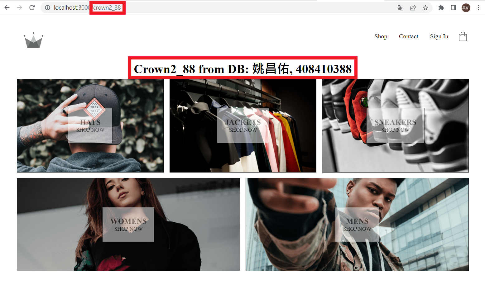
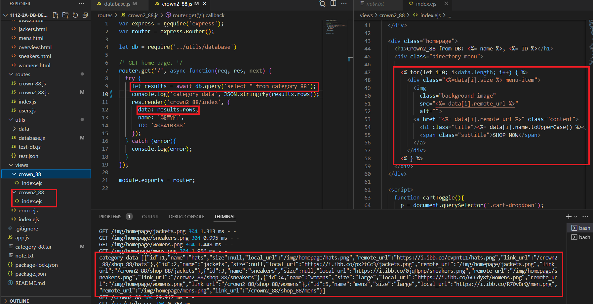

[My Github repo URL](https://github.com/LeoYau2/1112-2A-db-demo-408410388)

### W03-P1: test-db.js can retrieve 5 data of category_xx tables


### W03-P2: fetch category data and replace crown2_xx/index.ejs with these data





### Github logs of week 01~03


```
$ git log --pretty=format:"%h%x09%an%x09%ad%x09%s" --after="2023-2-13"
862b75b LeoYau2 Wed Mar 1 22:42:42 2023 +0800   w03
e82175d LeoYau2 Wed Mar 1 20:37:15 2023 +0800   W02-P3: 建立路由 /crown_88 顯示 crown_88/index.ejs
dcacd4a LeoYau2 Sun Feb 26 04:18:45 2023 +0800  w02
832f2ba LeoYau2~        Thu Feb 23 18:10:49 2023 +0800  add w02 files
e760dea LeoYau2~        Thu Feb 23 17:40:58 2023 +0800  w02-p3: 建立路由 /crown_88 顯示 crown_88/index.ejs6b05d4a LeoYau2~        Wed Feb 22 13:30:37 2023 +0800  add demo/w01 code
7c5e787 LeoYau2 Thu Feb 16 17:42:23 2023 +0800  copy theme files to public folder
22dda99 LeoYau2 Thu Feb 16 17:17:59 2023 +0800  w01 first commit
6718038 LeoYau2 Thu Feb 16 16:42:22 2023 +0800  Initial commit
```
